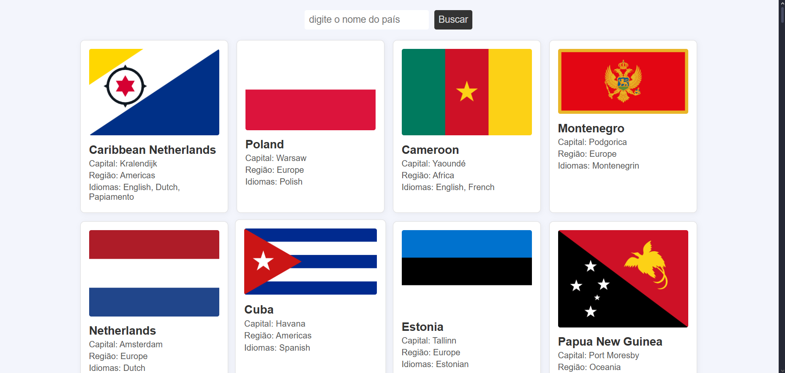

# 🌍 Lista de Países

Projeto web que consome a API [REST Countries](https://restcountries.com) e exibe uma lista de países com informações como **nome**, **capital**, **região**, **idiomas** e **bandeira**. Também permite **pesquisar** por país usando nome, capital, região ou idioma.

## 🖼️ Screenshot

---

## 🚀 Tecnologias Utilizadas

- HTML5
- CSS3
- JavaScript
- API REST Countries

---

## 💡 Funcionalidades

- ✅ Busca por nome, capital, região ou idioma
- ✅ Listagem de todos os países
- ✅ Imagens das bandeiras

---
